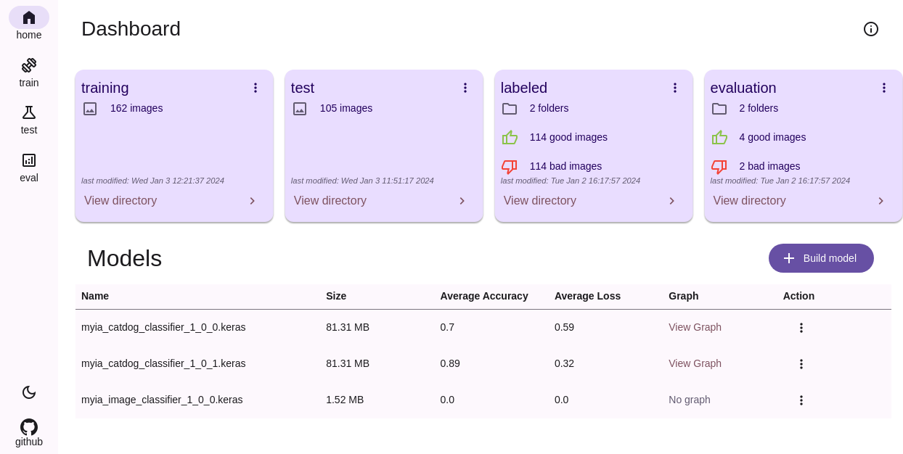
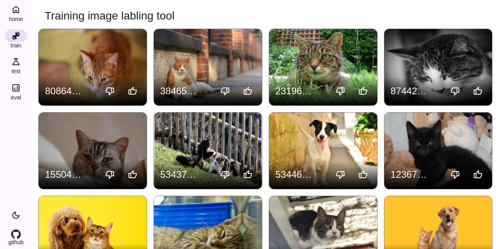
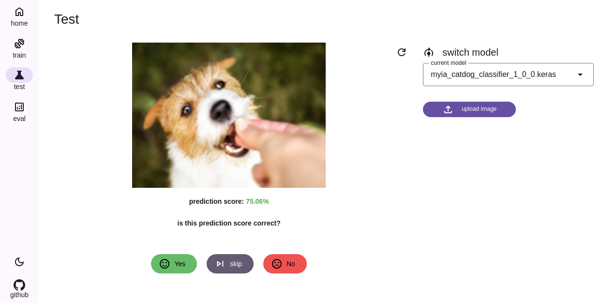
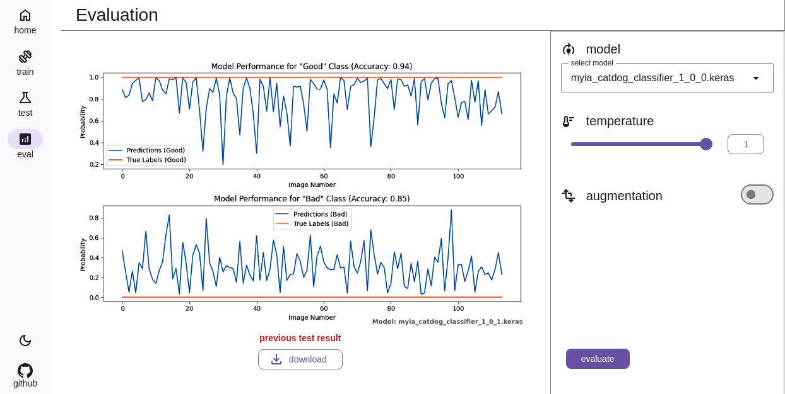
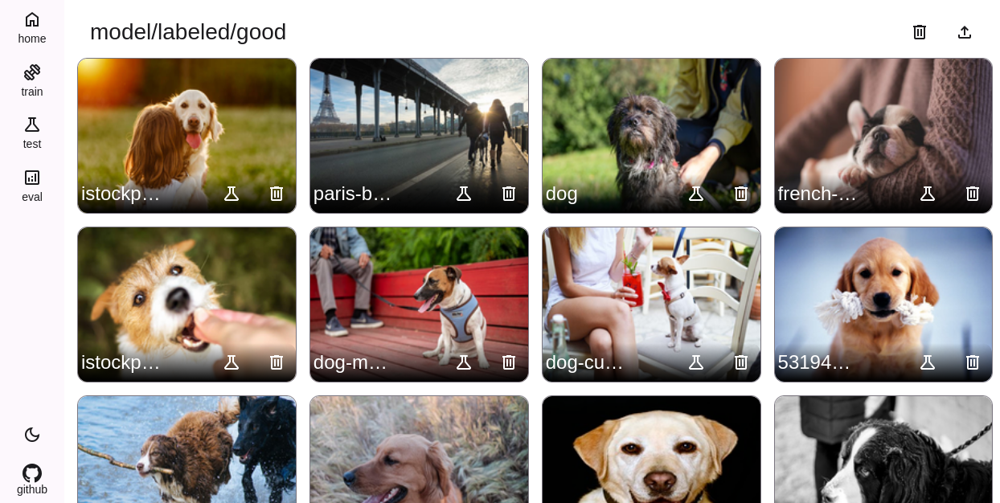
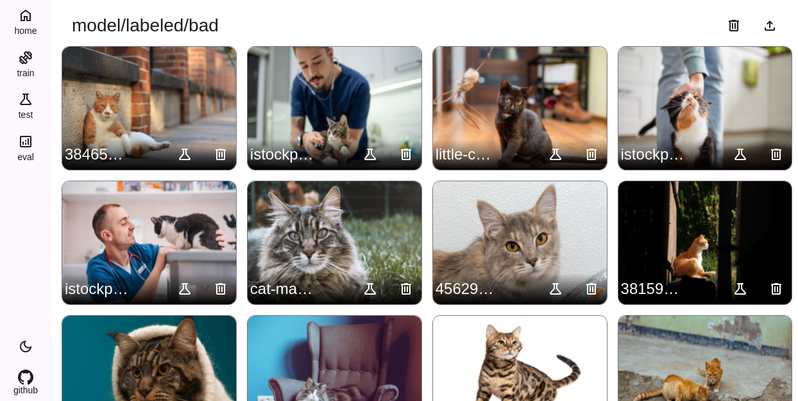
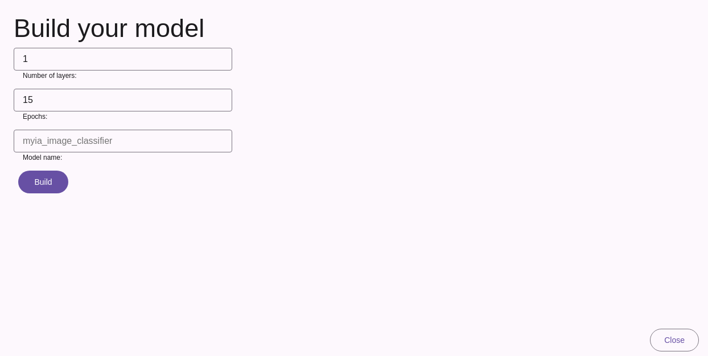

# MYIA
[](https://app.fossa.com/projects/git%2Bgithub.com%2Fbethropolis%2Fmyia?ref=badge_shield)

this is a nocode platform for training, testing, evaluating, and building image classifier models 


<h2>Table of Contents</h2>

- [Features](#features)
- [Installation](#installation)
- [Usage](#usage)
- [Screenshots](#screenshots)
- [packages used](#packages-used)
- [Contributing](#contributing)
- [License](#license)


## Features
- model training
- model testing
- model evaluation
- file explorer
- bulk image upload
- screenshot script (go)
- image crawler/scrapper (go)
- graph generation
- dark/light mode


  
---

## Installation

1. Clone the repository.
    ```
        git clone https://github.com/bethropolis/myia.git
    ```

2. Install the dependencies by running the following command:
    ```sh
    pip install -r requirements.txt
    ```


3. Setup project:
    ```sh
    python setup.py 
    ```

4. create a virtual environment (optional):
    ```sh
    python -m venv myenv
    ```
    > activate the virtual environment
    ```bash
    # windows
    myenv\Scripts\activate

    # linux / mac
    source myenv/bin/activate
    ```
5. run the app:
    ```sh
     python app.py
    ```
    > open your browser and go to http://localhost:5000


---
## Usage 

1. Upload images to the app

    - upload images to the `training directory`
    - head to `http://localhost:5000/directory?path=training/train` and upload your images


2. label the images

    - Open the `train` page (`http://localhost:5000/train`)

    - label the images either as good or bad by clicking the `thumbs up` or `thumbs down` button.

    - the app can only generate binary classification models so you can only label the images as `good` or `bad`

        - `thumbs up` for `good` which could represent classification `A`
        - `thumbs down` for `bad` which could represent classification `B`


    > currently the app only supports two labels `good` and `bad` 

3. build the model

     - To build the model, head to the `home` page (`http://localhost:5000/`) and click the `build model` button
     
     - In the next page you will have to input:
        `No of epochs` - the number of times the model will be trained (default is 15) 
        `No of layers` - the number of layers the model will have (default is 3)
        `Model name` - the name of the model (default is `myia_image_classifier`)

    - click the `build model` button to start building the model

    The model will be saved in the `model/image_model` directory as a `keras` model

    > Note: The higher the number of epochs the longer it will take to build the model 
    


4. test the model
        - To test the model, open the `test` page (`http://localhost:5000/test`) and upload an image to test the model with
           or test with images in the `test` directory (`http://localhost:5000/directory?path=training/test`)


5. evaluate the model
    - To evaluate the model, open the `evaluate` page (`http://localhost:5000/evaluate`) and upload an image to evaluate the model with
        or evaluate with images in the `evaluate` directory (`http://localhost:5000/directory?path=model/evaluation`)

    - The evaluation results will be saved in the `model` directory as a `json` file and a graph will be generated and saved in the `static` directory as a `png` file


---

## Screenshots

| Image                                                                                                 | Description                                   |
| ----------------------------------------------------------------------------------------------------- | --------------------------------------------- |
|                  | A screenshot of the Home page                 |
|              | A screenshot of the Training page             |
|               | A screenshot of the Testing page              |
|            | A screenshot of the Evaluation page           |
|                    | A screenshot of a directory                   |
|                    | A screenshot of a directory                   |
|  | A screenshot of the page for building a model |


---
## packages used
- [Flask](https://flask.palletsprojects.com/)
- [Pillow](https://pillow.readthedocs.io/en/stable/)
- [Tensorflow](https://www.tensorflow.org/)
- [Keras](https://keras.io/)
- [Numpy](https://numpy.org/doc/stable/user/whatisnumpy.html)
- [matplotlib](https://matplotlib.org/)
- [chromedp](https://github.com/chromedp/chromedp)
- [goquery](https://github.com/PuerkitoBio/goquery)


---

## Contributing
Feel free to ping me a pull requests if you want to contribute.

## License

This project is licensed under the [MIT License](LICENSE).


happy coding 💜

[](https://app.fossa.com/projects/git%2Bgithub.com%2Fbethropolis%2Fmyia?ref=badge_large)
